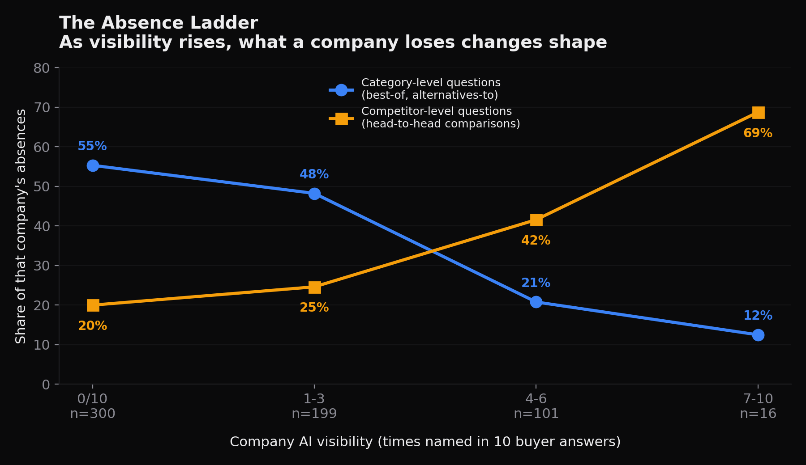
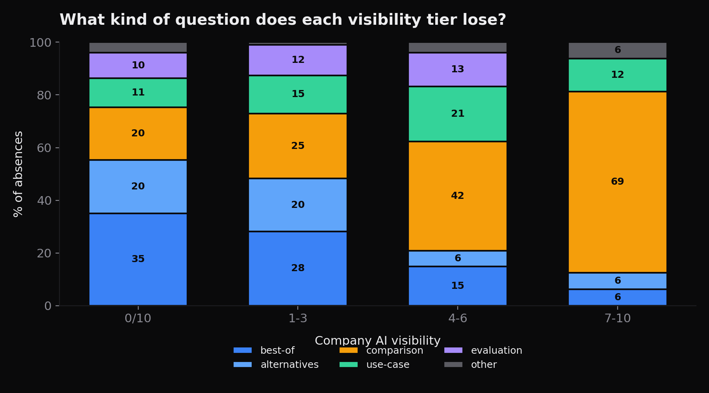
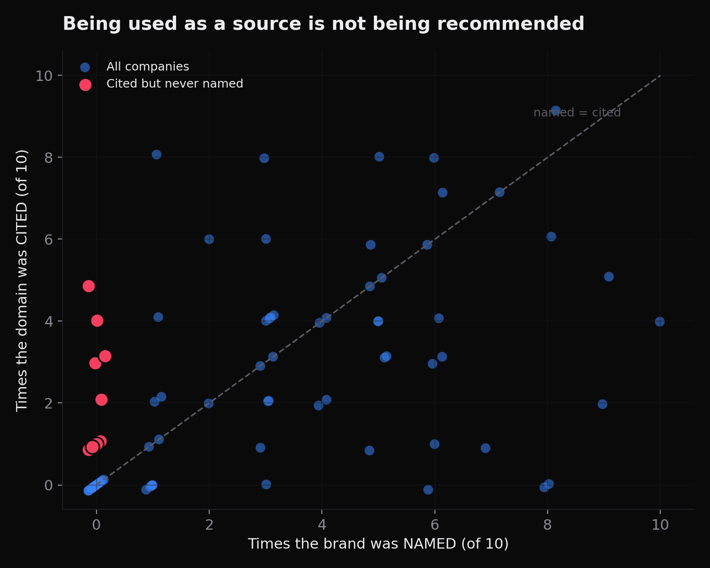
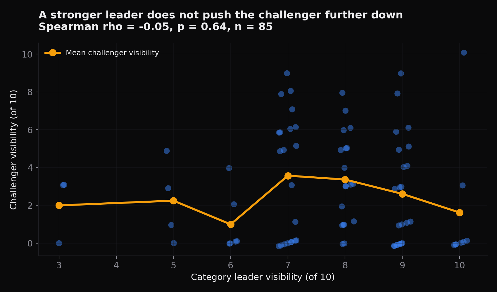
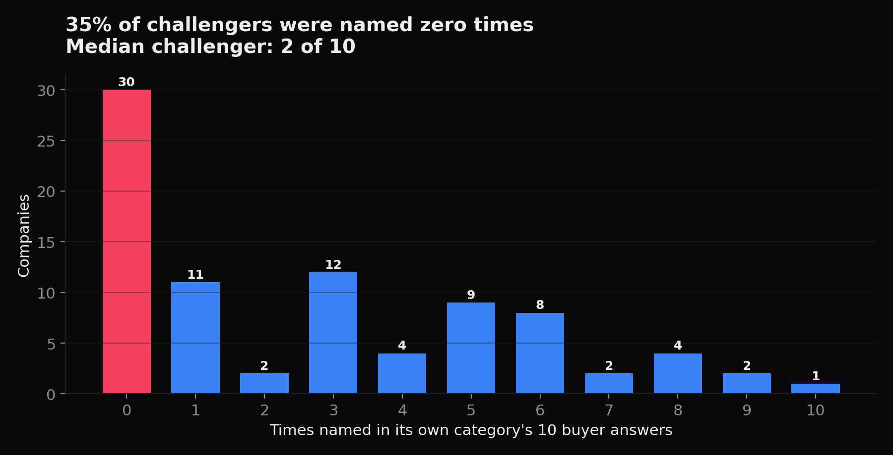

# The Absence Ladder

### How the shape of a company's AI invisibility changes as its visibility rises

**The 2026 State of GEO, Volume II**
Broadcastwell · July 2026

---

## Abstract

Most measurement of AI search visibility reports a single number: how often an engine names a company when buyers ask about its category. That number is useful but flat. It says nothing about *which* questions a company loses, and therefore nothing about what to do next.

This study takes the inverse view. Across 85 B2B software companies in 60 categories, we recorded every buyer question the engine answered without naming the company, then classified all 616 of those absences by question shape. The result is a systematic and statistically significant pattern we call the absence ladder.

Companies with no visibility lose category-level questions: best-of shortlists and alternatives-to-incumbent queries. Companies with high visibility lose almost nothing except head-to-head comparisons against a named rival. The mix shifts monotonically across every tier in between.

We also report one strong null result. The strength of a category's leader does not predict how invisible its challenger is. AI visibility, in this dataset, is not zero-sum.

---

## 1. Why absence, not presence

A visibility score of 2 out of 10 tells you that eight answers went by without you. It does not tell you what those eight answers were about. Two companies can both score 2 and be in entirely different strategic positions: one losing every "best X software" list, the other losing only "X vs Y" comparisons against a specific rival.

Those are different problems with different fixes, and a single percentage hides the difference completely.

So we inverted the unit of analysis. Instead of studying the answers where a company appeared, we studied the answers where it did not, and asked what those questions had in common.

---

## 2. Method

**Sample.** 85 B2B software companies across 60 distinct product categories. The sample is challenger-skewed by construction: companies were selected as plausible non-leaders in categories with an identifiable incumbent, which is the population where visibility gaps are actionable.

*Note on the category count.* Volume I reported 61 categories. That figure counts every category string in the collection sheet, including one category whose company was queued but never scored. Volume II analyses only companies with complete scores, which is 60 categories. The 85 companies are the same in both volumes.

**Procedure.** For each company we generated ten buyer questions reflecting how a real purchaser researches that category, then ran each question through one AI engine with live web search enabled. For every answer we recorded whether the company's brand was named, whether its domain was cited as a source, and which competitor was named most often and how many times.

**Absence records.** For every question where the company was not named, we retained the full question text. That produced 616 absence records. We validated completeness: for all 85 companies, absence count equals ten minus the visibility score, with zero mismatches.

**Classification.** Each absence question was assigned one shape by regular-expression rules applied in fixed precedence:

| Shape | Rule | Example |
|---|---|---|
| Head-to-head comparison | contains "vs", "versus", or "comparison" | "Whitespace vs Artificial Labs: which is better?" |
| Alternatives-to-incumbent | contains "alternative" | "What are the best Sequel alternatives?" |
| Best-of shortlist | contains "best" or "top N" | "What is the best resource management software?" |
| Evaluation criteria | evaluate, choose, select, criteria, pricing model | "How should I compare pricing models when switching?" |
| Use case / problem | opens "how can/do/does" or contains "use case" | "How can this software reduce manual data entry?" |
| Definitional | opens "what is/are" without "best" | "What is reinsurance placement software?" |

2.8% of records fell to *other*. Precedence matters and is stated so the classification is reproducible: a question containing both "best" and "vs" is counted as a comparison.

**Engine.** One engine, one run per question. See Limitations.

---

## 3. Finding 1: The absence ladder

The distribution of absence shapes shifts systematically with visibility.

| Visibility | Companies | Absences | Category-level | Head-to-head |
|---|---|---|---|---|
| Named 0 of 10 | 30 | 300 | **55.3%** | 20.0% |
| Named 1–3 | 25 | 199 | 48.2% | 24.6% |
| Named 4–6 | 21 | 101 | 20.8% | 41.6% |
| Named 7–10 | 8 | 16 | 12.5% | **68.8%** |

*Category-level = best-of shortlists plus alternatives-to-incumbent queries.*

*Note on the top row. Nine companies scored 7 or above. One of them scored 10 of 10 and therefore produced no absence records at all, so the top tier's absence analysis rests on the remaining 8 companies and their 16 records. Company counts across the four tiers sum to 84 in this table and to 85 in the sample.*

The relationship is significant and holds under multiple tests:

- Chi-square across tier × shape: **χ² = 61.8, df = 15, p = 1.3 × 10⁻⁷**, Cramér's V = 0.18
- Visibility vs absence-is-category-level: **r = −0.284, p = 6.8 × 10⁻¹³**, n = 616
- Visibility vs absence-is-comparison: **r = 0.234, p = 4.1 × 10⁻⁹**
- Excluding the small top tier entirely, the comparison effect survives: **r = 0.184, p = 5.9 × 10⁻⁶**, n = 600

**Interpretation.** Invisibility is not one condition. It has stages.

A company named zero times is failing at the category door. The engine does not consider it a member of the set when a buyer asks who the players are. More than half its losses are questions that never mention a competitor by name — they simply ask who exists, and the answer does not include it.

A company named seven or more times has cleared that door. It is a recognised member of the category. What it now loses is the second gate: direct comparison against a specific named rival. Nearly seven in ten of its remaining absences are "X vs Y" questions.

The middle tiers sit exactly where you would expect if the two gates are sequential rather than simultaneous.

**Practical consequence.** The work implied by each stage is different. A company at the category door needs entity presence and inclusion in the third-party sources engines consult when assembling a set. A company at the comparison gate needs comparison content that a model can quote against a specific named competitor. Prescribing the second to a company stuck at the first is a common and expensive mistake, and a single visibility percentage cannot tell you which one you are.

---

## 4. Finding 2: Being cited is not being recommended

Brand naming and domain citation correlate, but loosely: Pearson r = 0.512, Spearman ρ = 0.577 (p < 10⁻⁶). They are not the same signal.

- **29.4%** of companies were cited more often than they were named.
- Among those, the average company was named 2.2 times but cited 4.4 times.
- **Nine companies were named zero times while their own domain was cited as a source**, one of them five times out of ten.

Those nine companies are in an unusual position. The engine reads their pages, trusts them enough to quote as evidence, and then recommends someone else. The content is working as a source and failing as a signal of who to buy from.

**Practical consequence.** Content volume is not the binding constraint for this group. Being quotable and being recommendable are separate properties, and a content strategy aimed only at the first will not deliver the second.

---

## 5. Finding 3: Leader strength does not suppress the challenger (null result)

We expected that a dominant category leader would crowd out the challenger. It does not.

- Spearman ρ between leader visibility and challenger visibility: **−0.051, p = 0.64**, n = 85
- Challenger mean when the leader scores 9–10: 2.35
- Challenger mean when the leader scores 7–8: 3.48
- Challenger mean when the leader scores 6 or below: 1.57
- Kruskal-Wallis across those bands: p = 0.052

The relationship is not monotonic and is not significant at conventional thresholds. Challengers in categories with a *moderately* strong leader scored highest on average, and challengers in categories with a *weak* leader scored lowest.

**Interpretation, stated cautiously.** In this dataset, an answer naming a strong incumbent does not appear to be an answer that had no room for anyone else. The plausible reading is that a well-defined category with an obvious leader is also a category the engine understands well enough to name a second and third option, whereas a category with no clear leader is often a category the engine does not model cleanly at all. In seven of the 85 company sweeps no brand scored above 5 of 10, and challengers in those categories did worst.

We report this as a null result rather than a finding. It should be retested on a larger sample before anyone builds strategy on it.

---

## 6. Category concentration

- Median challenger visibility: **2 of 10**. Mean: 2.75.
- **35.3%** of challengers were named **zero** times in their own category.
- Median category leader: **8 of 10**. Mean: 7.73.
- In **58.8%** of the 85 company sweeps the category leader scored 8 or above; in **36.5%**, 9 or above.
- In only **8.2%** of sweeps did no brand score above 5 of 10.
- The median leader-minus-challenger gap was **5 points**; in **23.5%** of sweeps the gap was 8 points or more.
- In 16 sweeps the challenger scored zero while the leader scored 8 or above.

---

## 7. Limitations

These matter and we state them plainly.

**One engine, one run.** All answers came from a single AI engine with live web search, one run per question. AI answers vary between runs; we did not measure that variance, and we cannot claim these proportions would replicate exactly. Treat the direction of each finding as the result, not the decimal.

**Challenger-skewed sample.** Companies were selected as plausible non-leaders. The 35% zero-visibility rate is a property of this sample, not of B2B software generally.

**Small top tier.** Nine companies scored 7 or above, but one scored a perfect 10 of 10 and contributed no absence records, so the top tier rests on 8 companies and 16 absence records. The 68.8% comparison figure rests on a small base. The underlying trend survives when that tier is excluded, which is why we report both.

**Classification is rule-based.** Question shapes were assigned by regular expression, not human annotation. Rules and precedence are published so anyone can reclassify and check.

**Question generation is a design choice.** The ten questions per category were generated to reflect realistic buyer research. A different question set would produce a different absence mix. The shapes are drawn from that set, which is why the tier comparison is internally consistent even if absolute proportions are set-dependent.

**60 categories is enough to see a pattern, not enough to call any individual category.**

---

## 8. Data availability

Three datasets are published with this paper. Company names are replaced with stable identifiers; question text and all scores are unmodified.

| File | Rows | Contents |
|---|---|---|
| `challenger_visibility_v2.csv` | 85 | Per-company: category, times named, times cited, leader score, gap, absence count |
| `absence_questions_classified.csv` | 616 | Every absence question, its verbatim text, assigned shape, and the company's visibility tier |
| `absence_shape_by_tier.csv` | 4 | The aggregate table behind Finding 1 |

Anyone can reproduce every number in this paper from these three files.

---

## 9. What this changes

If the absence ladder holds, "AI visibility" is not one metric and should not be managed as one.

The useful question is not *what percentage of answers name us*. It is *what kind of question are we currently losing*. That answer tells you whether you are fighting for admission to a category or for preference within one, and those require different work.

The single number is a symptom. The shape of the absence is the diagnosis.

---

*The 2026 State of GEO, Volume II. Broadcastwell, Bloomington, Indiana. Data collected July 2026. Volume I, covering 860 scored answers and 5,160 citations, is published separately with a DOI.*
